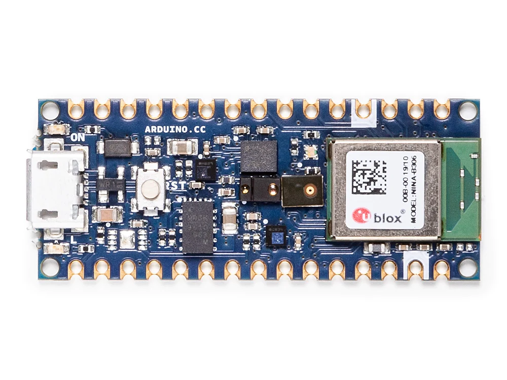

# Power Management In Arduino Nano 33 BLE Sense

This repository contains the 'Keyword Spotting' model, beside all example codes for optimising the Arduino Nano 33 BLE Sense. Our working draft towards a article can be [found here](https://docs.google.com/document/d/1btCJYSLeryvZjLbE2H2kwtYqe2a-JlhR_FeShnrovlo/edit?usp=sharing)

!
